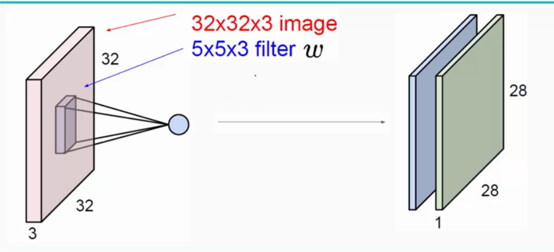
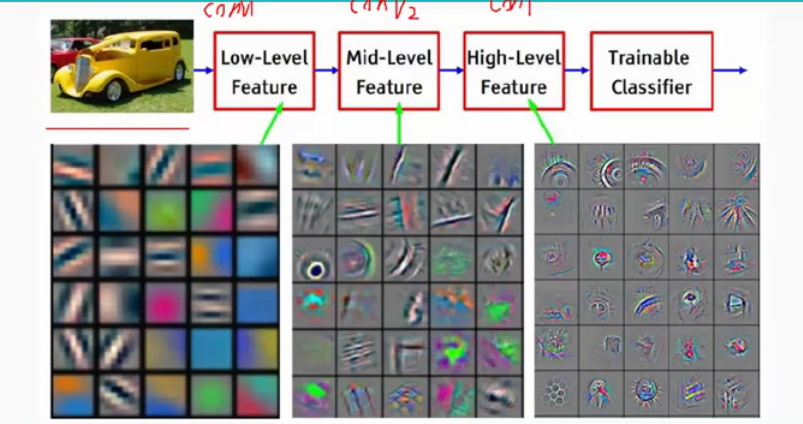
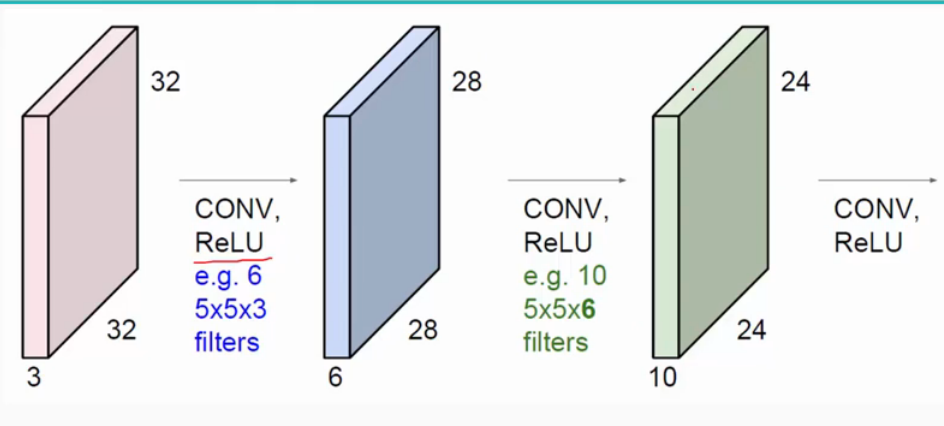
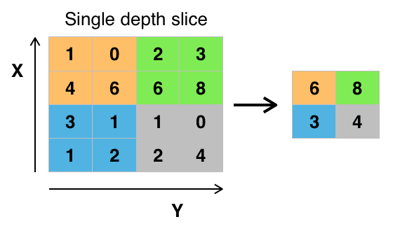
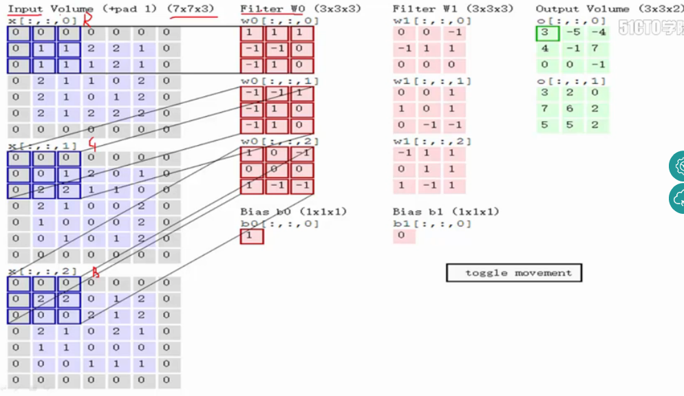
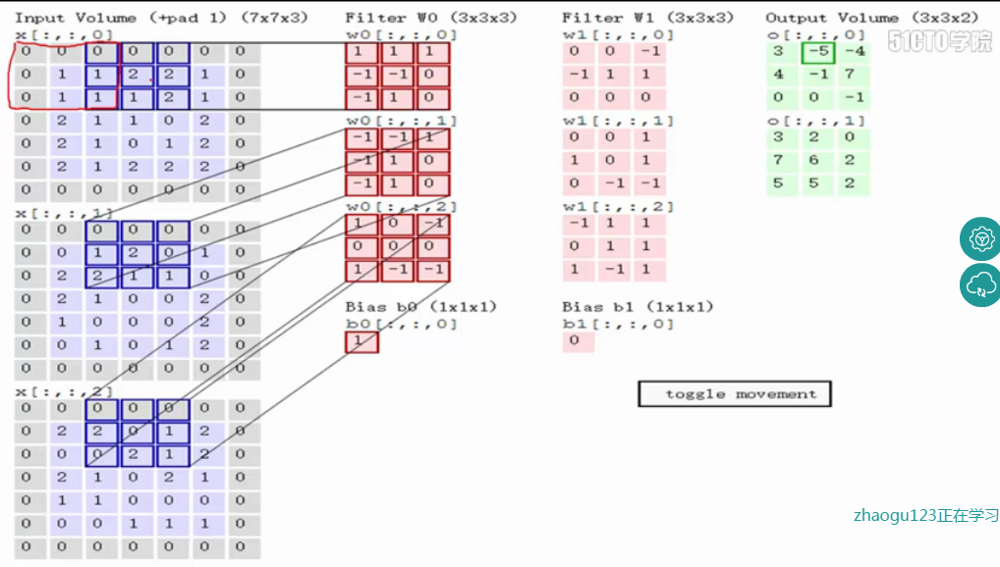

## 前言
这是一篇科普性质的文章 , 旨在让读者快速了解CNN , 这包括CNN的来源 , 结构 , 简单的原理解释 和常用的测试数据集 , 至于实现方法 , 参见tensorflow的相关介绍;
## CNN原理——人工神经网络的蓝本_人类视觉原理
* 1981年诺贝尔医学奖 , 颁发给了David Hubel(出生于加拿大的美国神经生物学家) 和TorstenWiesel，以及 Roger Sperry。
* 前述三人中前两位的主要贡献，是“发现了视觉系统的信息处理”，可视皮层是分级的 如下图所示。

* 从图中可以看到 , 人类的视觉原理如下：
  从原始信号摄入开始(瞳孔摄入像素 Pixels) ,
  接着做初步处理(大脑皮层某些细胞发现边缘和方向) ,
  然后抽象(大脑判定，眼前的物体的局部特征) ,
  然后进一步抽象(依据前述特征 , 大脑进一步判定该物体到底是什么)
  
  更多的例子如下 :
  
  
  基本原理就是若干低级特征组成更高一级的特征 , 层层迭代 , 最后归纳为一个具体概念 .
  仿照人眼的这种识别流程 , 人们提出了人工神经网络这一仿生学设计概念 , 即构造多层的神经网络 , 低层的识别简单的样本特征 , 若干次级特征归纳出更高一级特征 , 层层迭代 , 最终在顶层作出分类 .
## CNN定义和结构
1.  什么是CNN ?
    CNN = Convolutional Neural Network , 卷积神经网络是一类
    在图像处理方面极具优势的深度神经网络 , 特别是大图像的处理问题.
    最早由 *Yann LeCun* 提出并被用于手写字体识别上(也就是经典的MNIST训练集中的那些图片的识别) , 其提出的初代CNN被称之为LeNet(下图为其结构示意) .
    
2.  CNN的结构
    卷积神经网络常常由 输入层 , 卷积层 , 激活函数层 , 池化层 , 损失函数层 , 全连接层 和softmax分类器层 组成 .  
    (**本质上是权值共享的全连接神经网络**)
    *   卷积层(convolution)  
        **用途 :** 卷积层用于进行特征提取  
        
        上图中 , 二维卷积中用的卷积层范围称为感受野(也就是图中标的filter<过滤器>) , 图中感受野大小为*5 * 5 * 3* , 原图大小为*32 * 32 * 3*;  
        **Note : 感受野的深度和图像的深度要相同**  
        **如本例中 , 原图是RGB三通道图像那么原图的矩阵深度就是3 , 那么感受野的最后一个大小参数也应该是3**   
        在卷积(convolute)之后 , 采样(sample)得到的图像(称feature map)大小为*28 * 28 * 1* ;
        而之后再对feature map 进行二次采样(subsample) , 之后如需要则继续卷积 , 循环往复至流程结束;  
        一般会设计多层卷积来获得高层次图像特征  
        示例图如下
        
        其原理如下图(*图中ReLU为一类激活函数 全称为 Rectified Linear Unit , 译名为线性整流函数*) :
        
        特性_局部感知 : 每个神经元只与上一层的部分神经元相连 , 即感知局部而非整体;  
            依据 : 局部像素关系紧密 , 较远像素相关性弱; ==> 低层局部感知 , 到高层再逐步综合;(受生物视觉系统启发 , 缓解了计算参数过多的问题)  
        特性_权值共享 : 从一个局部学到的信息 , 应用到图像的其他部位 , 即卷积核(感受野)的权值(参数)不随卷积核(感受野)的移动而改变 , 对全图进行采样(滤波) , 一个特性对应一个卷积核;  
            依据 : 图像的局部统计特征相较于全图具有重复性(位置无关性) , 这代表针对某一特定特征的卷积核是可复用的;  
    *   激活函数层(activation function)  
        **用途 :** 定义了其控制的节点在给定的输入或输入的集合下的输出;  
        常用的激活函数有  
            ReLU 也即线性整流函数 最常用 , 可提升数倍神经网络的训练速度 , 但是对模型的泛化准确度(对未知数据的预测准确度)不造成显著影响;  
            Sigmoid   
            双曲正切函数  

    *   池化层(Pooling)  
        **用途 :** 作用于每个输入的特征并减少其大小;  
        
        种类多样 , 本质是降采样;  
        常见的有 最大池化(常用的形式是每隔2个元素从图像划分出2 * 2的区块，然后对每个区块中的4个数取最大值。这将会减少75%的数据量。如上图所示) , 平均池化 , L2-范数池化等;  
    *   损失函数层(loss)  
        **用途 :** 用于决定训练过程中如何“惩罚”网络的预测结果和真实结果之间的差异，它通常是网络的最后一层;
    *   全连接层
        **用途 :** 用于将前面特征抽取层抽到的特征表达向量映射到下一层或最终的softmax层;
        用于分类任务的卷积神经网络最后几层往往是全连接层;
    *   softmax层
        **用途 :** 分类;
        Softmax函数，或称归一化指数函数 , 是逻辑函数的一种推广。它能将一个含任意实数的K维向量 “压缩”到另一个K维实向量中，使得每一个元素的范围都在(0,1)之间，并且所有元素的和为1(也可视为一个 (k-1)维的hyperplan，因为总和为1，所以是subspace)。该函数的形式通常按下面的式子给出 :
        
        其中j取值为1~k的整数;
## 附录1 : 关于MNIST dataset
MNIST = Mini National Institute of Standards and Technology 
NIST 是美国国家标准与技术研究所的简称 , MNIST 是该研究所提供的训练集的子集 , 其中训练集 (training set) 由 250 个不同人手写的数字构成, 其中 50% 是高中学生, 50% 来自人口普查局 (the Census Bureau) 的工作人员. 测试集(test set) 也是同样比例的手写数字数据.
关于如何得到该数据 , 可在如下链接查找.
[MNIST_download](http://yann.lecun.com/exdb/mnist/)
## 附录2 : 关于Fashion MNIST dataset

 由Zalando（一家德国的时尚科技公司）旗下的研究部门提供。其涵盖了来自 10 种类别的共 7 万个不同服饰类商品的正面图片。
 创造这个新数据集的原因是 MNIST被使用过多且内容仅为数字 , 不再适应更复杂的应用测试需求 ;
 关于该数据集的详细信息 , 可以在github上面下载
 [fashion MNIST](https://github.com/zalandoresearch/fashion-mnist)
## 附录3 : 关于二维卷积
将filter和输入图重合之后 , 对应位置相乘之后求加和 , 之后filter中心向右移动一定的步长(stride) , 重复上述流程 , 方向为左至右 , 上至下 , 直至图像右下角最后一组像素 , 就是二维卷积;

Note1 : 图中的卷积结果加上了偏移量(Bias);
Note2 : 图中的原图周围灰色部分是补充的边框(zero pad) , 是一个经验值 , 不一定是1 , 使用它是为了使得输入图像和输出图像具有相同的维度 , 如输入为5 * 5 * 3 , filter是3 * 3 * 3 , zero pad 为1 , 则输出图像为5 * 5 * 1 , 与输入图像具有相同的二维大小;
Note3 : 图2中的stride是2不是1;
## 参考资料
1.  [深度学习简介(一)——卷积神经网络](https://www.cnblogs.com/alexcai/p/5506806.html)
2.  [卷积神经网络_（1）卷积层和池化层学习](https://www.cnblogs.com/zf-blog/p/6075286.html)
3.  [详解 MNIST 数据集](https://blog.csdn.net/simple_the_best/article/details/75267863)
4.  [如何使用 Fashion MNIST 数据集](https://www.jianshu.com/p/2ed1707c610d)
5.  [关于CNN的两个特性](https://www.cnblogs.com/chenshan-crystal/p/7543780.html)
6.  [激活函数_wiki](https://zh.wikipedia.org/wiki/%E6%BF%80%E6%B4%BB%E5%87%BD%E6%95%B0)
7.  [卷积神经网络_wiki](https://zh.wikipedia.org/wiki/%E5%8D%B7%E7%A7%AF%E7%A5%9E%E7%BB%8F%E7%BD%91%E7%BB%9C#%E5%8D%B7%E7%A9%8D%E5%B1%A4)

