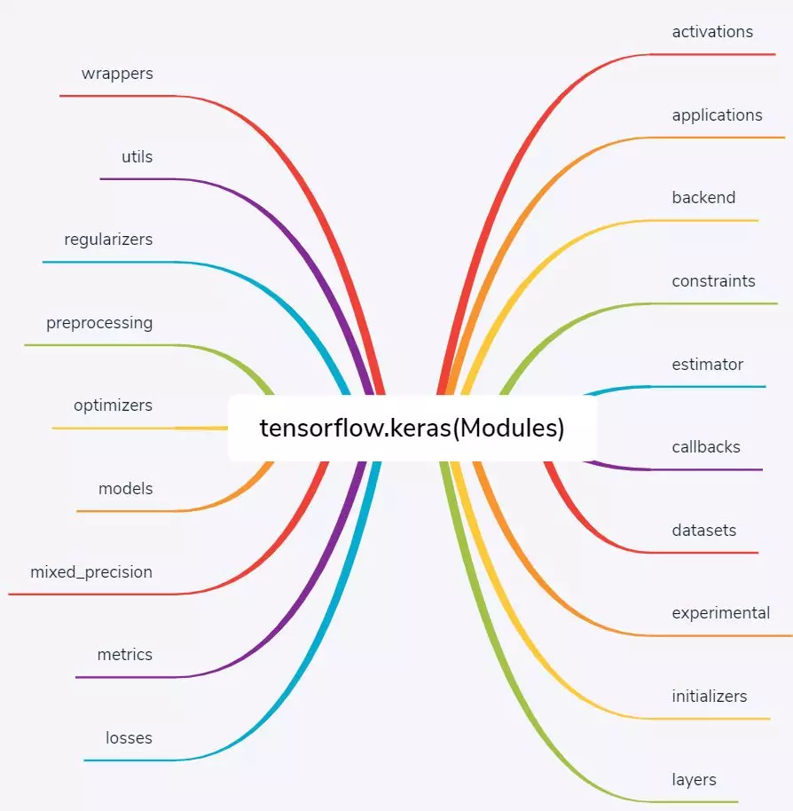
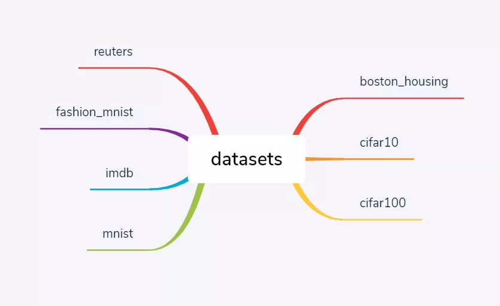
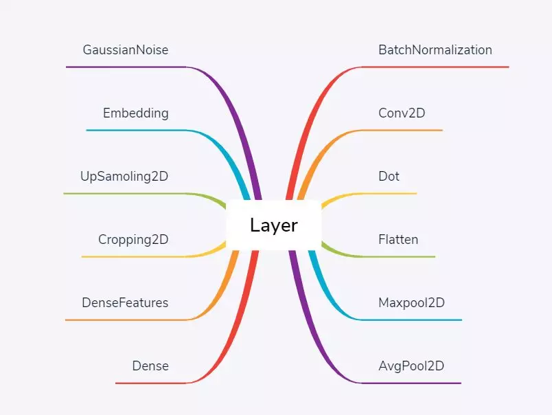
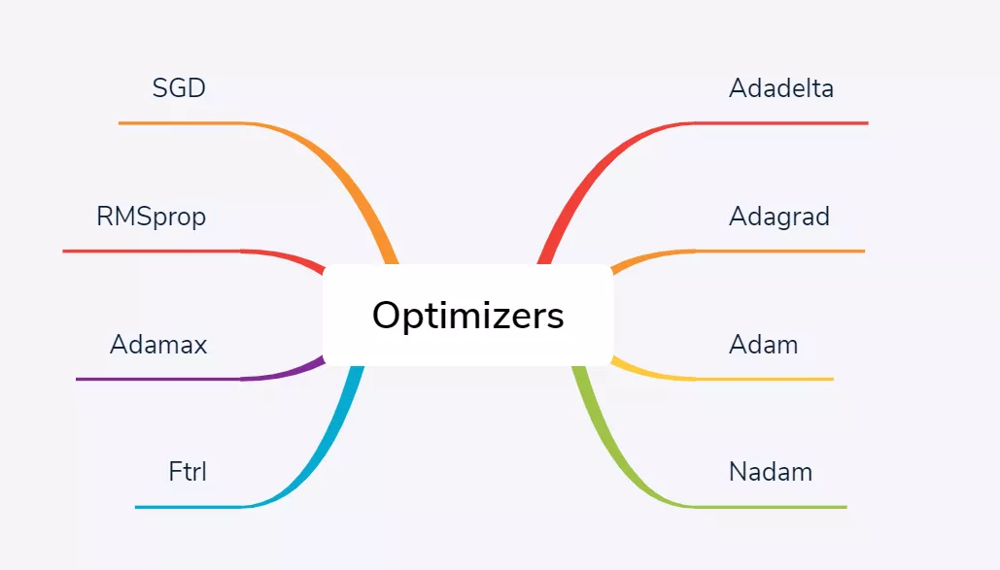
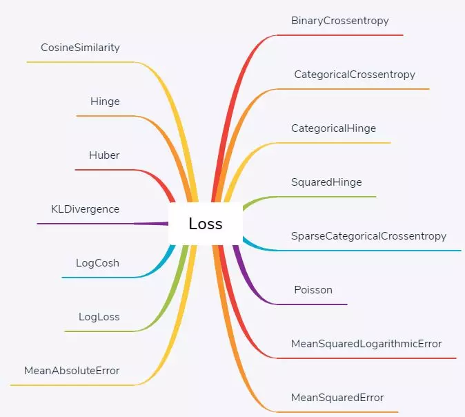

# 参考文献
[Keras介绍](https://mp.weixin.qq.com/s/0JtOH2_uzkcfjeAd012x1A)
## Keras简介
Tensorflow 2.0 的必备组件
包含

    Modules
    Class
    Functions

其中Modules 包含各种训练时必备组件
如
    activations(激活函数)
    losses(损失函数)
    optimizers(优化器)
### Modules 包含的函数

### Class 包含两个类

    Sequential
    Model

**用于堆叠模型**
### Functions 包含一个函数

    Input()

**用于实例化张量**
## Modules介绍
### 自带常用数据集
1.  Tensorflow 自带的数据集

2.  加载tensorflow自带数据集句式示例

        (train_images,train_labels),(test_images,test_labels)= keras.datasets.fashion_mnist.load_data()

### 自带神经网络层
1.  
2.  自带神经网络层的调用方法

        from tensorflow.keras import layers
        layers.Conv2D() # 2D卷积层
        layers.MaxPool2D() # 用于2D输入的最大池化层
        layers.Flatten() # 在保留axis(axis 0)的同时平移输入张量
        layers.Dense() # 密集连接层类 , 实现操作outputs = activation(inputs * kernel + bias)

**用于构建层结构**
### 激活函数
1.  
2.  使用例程

        from tensorflow.keras import layers
        layers.Conv2D(...,activation='relu')
        layers.Dense(...,activation='softmax'）
**用于使神经网络的表达能力更强**
### 优化器
1.  
2.  使用例程

        optimizers = tf.keras.optimizers.Adam()
        optimizers = tf.keras.optimizers.SGD()
大多数情况下，使用 adam 和 rmsprop 及其默认的学习率是稳妥的
除了通过名称来调用优化器 model.compile(‘名称’)，我们还可以通过实例化对象来调用优化器 model.compile(‘优化器’)。选取几个对比如下：

名称：SGD

对象：SGD(lr=0.01, momentum=0.0, decay=0.0, nesterov=False)

名称：RMSprop

对象：RMSprop(lr=0.001, rho=0.9, epsilon=None, decay=0.0)

名称：Adagrad

对象：Adagrad(lr=0.01, epsilon=None, decay=0.0)

名称：Adam

对象：

Adam(lr=0.001, beta_1=0.9, beta_2=0.999, epsilon=None, decay=0.0, amsgrad=False)

这些优化器对象都在 keras.optimizer 命名空间下。使用优化器对象来编译模型的好处是可以调节里面的超参数比如学习率 lr，使用名称来编译模型则只能采用优化器的默认参数，比如用 Adam 里面的学习率 0.001。
**在准备好数据并且设计好模型之后使用**
### 损失函数
1.  
2.  使用示例

        loss = tf.keras.losses.SparseCategoricalCrossentropy()
        loss = tf.keras.losses.mean_squared_error()
二分类问题: 最后一层激活函数是 sogmoid,损失函数是binart_crossentropy
多分类问题：最后一层激活函数是 softmax,损失函数是categorical_crossentropy
多标签问题：最后一层激活函数是 softmoid,损失函数是binary_crossentropy
回归问题 ：最后一层没有激活函数,损失函数是mse
Fashion_MNIST 是一个十分类问题，因此损失函数是 categorical_crossentropy。
### 指标 metrics
指标不会用于训练过程，只是让我们监控模型训练时的表现
除了 Keras 自带指标，我们还可以自定指标，下列的 mean_pred 就是自定义指标（该指标计算预测的平均值）。
    
    # 指标定义
    def mean_pred(y_true, y_pred):
    return K.mean(y_pred)
    # 指标使用
    model.compile(optimizer=‘sgd’,
    loss=‘binary_crossentropy’,
    metrics=[‘acc’, mean_pred])
## Class介绍
### Model
1.  用于实例化网络层 , 使之成为可以训练的模型
2.  常用的调用方法示例
    * 使用keras.Model API
    
            import tensorflow as tf
            inputs = tf.keras.Input(shape=(3,))
            x=tf.keras.layers.Dense(4,activation=tf.nn.relu(inputs)
            outputs=tf.keras.layers.Dense(5, activation=tf.nn.softmax)(x)
            model=tf.keras.Model(inputs=inputs, outputs=outputs)

    * 继承Model类

            import tensorflow as tf
            class MyModel(tf.keras.Model):
            def __init__(self):
                super(MyModel, self).__init__()
                self.dense1 = tf.keras.layers.Dense(4, activation=tf.nn.relu)
                self.dense2 = tf.keras.layers.Dense(5, activation=tf.nn.softmax)
            def call(self, inputs):
                x = self.dense1(inputs)
                return self.dense2(x)
            model = MyModel()
### Sequential
线性堆叠模型

    model = keras.Sequential()

    model = model.add(layers.Conv2D(input_shape=(x_train.shape[1], x_train.shape[2],x_train.shape[3]),filters=32,kernel_size=(3,3), strides=(1,1), padding='valid',activation='relu'))

    model.add(layers.MaxPool2D(pool_size=(2,2)))

    model.add(layers.Flatten())model.add(layers.Dense(32,activation='relu'))

    model.add(layers.Dense(10, activation='softmax'))

    model.compile(optimizer=keras.optimizers.Adam(),loss=keras.losses.SparseCategoricalCrossentropy(),metrics=['accuracy'])

## Function介绍
### input()
1.  参数介绍

        tf.keras.Input(
            shape=None,
            batch_size=None,
            name=None,
            dtype=None,
            sparse=False,
            tensor=None,
            **kwargs
        )
2.  使用方法示例

        x = Input(shape=(32,))
        y = Dense(16, activation='softmax')(x)
        model = Model(x, y)
## 完整例程
[first_test.py](../first_test.py)
## about fashion_mnist dataset
[10000*28*28]像素 , 10000张图像 , 28*28像素/图
1. element of the dataset is a 2D array
[
    [  0   0   0   0   0   1   0   0   0   0  41 188 103  54  48  43  87 168
    133  16   0   0   0   0   0   0   0   0]
    [  0   0   0   1   0   0   0  49 136 219 216 228 236 255 255 255 255 217
    215 254 231 160  45   0   0   0   0   0]
    [  0   0   0   0   0  14 176 222 224 212 203 198 196 200 215 204 202 201
    201 201 209 218 224 164   0   0   0   0]
    [  0   0   0   0   0 188 219 200 198 202 198 199 199 201 196 198 198 200
    200 200 200 201 200 225  41   0   0   0]
    [  0   0   0   0  51 219 199 203 203 212 238 248 250 245 249 246 247 252
    248 235 207 203 203 222 140   0   0   0]
    [  0   0   0   0 116 226 206 204 207 204 101  75  47  73  48  50  45  51
    63 113 222 202 206 220 224   0   0   0]
    [  0   0   0   0 200 222 209 203 215 200   0  70  98   0 103  59  68  71
    49   0 219 206 214 210 250  38   0   0]
    [  0   0   0   0 247 218 212 210 215 214   0 254 243 139 255 174 251 255
    205   0 215 217 214 208 220  95   0   0]
    [  0   0   0  45 226 214 214 215 224 205   0  42  35  60  16  17  12  13
    70   0 189 216 212 206 212 156   0   0]
    [  0   0   0 164 235 214 211 220 216 201  52  71  89  94  83  78  70  76
    92  87 206 207 222 213 219 208   0   0]
    [  0   0   0 106 187 223 237 248 211 198 252 250 248 245 248 252 253 250
    252 239 201 212 225 215 193 113   0   0]
    [  0   0   0   0   0  17  54 159 222 193 208 192 197 200 200 200 200 201
    203 195 210 165   0   0   0   0   0   0]
    [  0   0   0   0   0   0   0  47 225 192 214 203 206 204 204 205 206 204
    212 197 218 107   0   0   0   0   0   0]
    [  0   0   0   0   1   6   0  46 212 195 212 202 206 205 204 205 206 204
    212 200 218  91   0   3   1   0   0   0]
    [  0   0   0   0   0   1   0  11 197 199 205 202 205 206 204 205 207 204
    205 205 218  77   0   5   0   0   0   0]
    [  0   0   0   0   0   3   0   2 191 198 201 205 206 205 205 206 209 206
    199 209 219  74   0   5   0   0   0   0]
    [  0   0   0   0   0   2   0   0 188 197 200 207 207 204 207 207 210 208
    198 207 221  72   0   4   0   0   0   0]
    [  0   0   0   0   0   2   0   0 215 198 203 206 208 205 207 207 210 208
    200 202 222  75   0   4   0   0   0   0]
    [  0   0   0   0   0   1   0   0 212 198 209 206 209 206 208 207 211 206
    205 198 221  80   0   3   0   0   0   0]
    [  0   0   0   0   0   1   0   0 204 201 205 208 207 205 211 205 210 210
    209 195 221  96   0   3   0   0   0   0]
    [  0   0   0   0   0   1   0   0 202 201 205 209 207 205 213 206 210 209
    210 194 217 105   0   2   0   0   0   0]
    [  0   0   0   0   0   1   0   0 204 204 205 208 207 205 215 207 210 208
    211 193 213 115   0   2   0   0   0   0]
    [  0   0   0   0   0   0   0   0 204 207 207 208 206 206 215 210 210 207
    212 195 210 118   0   2   0   0   0   0]
    [  0   0   0   0   0   1   0   0 198 208 208 208 204 207 212 212 210 207
    211 196 207 121   0   1   0   0   0   0]
    [  0   0   0   0   0   1   0   0 198 210 207 208 206 209 213 212 211 207
    210 197 207 124   0   1   0   0   0   0]
    [  0   0   0   0   0   0   0   0 172 210 203 201 199 204 207 205 204 201
    205 197 206 127   0   0   0   0   0   0]
    [  0   0   0   0   0   0   0   0 188 221 214 234 236 238 244 244 244 240
    243 214 224 162   0   2   0   0   0   0]
    [  0   0   0   0   0   1   0   0 139 146 130 135 135 137 125 124 125 121
    119 114 130  76   0   0   0   0   0   0]
  ]
